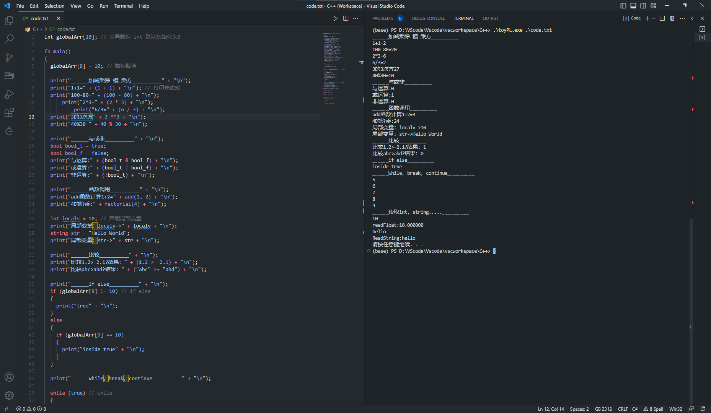

#### 简述

项目为编译原理大作业，解释型语言解释器，实现了一种简单的类C风格的解释性语言。

解释器支持

- int,long,string,bool的数值运算
- if-else分支
- while循环
- 内建print、read等函数
- 函数递归调用
- 基本数据类型数组存储等

解释器具有良好的报错提示。

#### 构建

项目使用windows下VS构建，打开项目，确保路径英文，然后右键项目生成。会在目标文件中生成exe和测试文件code.txt。

#### 说明

code.txt需要GB2312编码，否则exe执行会出现乱码情况

可以控制台执行代码toyPL.exe code.txt 执行，另可选择：

- -l -p 选项打印lexer 和 syntaxparser 生成的token 和 语法树
- -o 指定打印的输出文件

例：`toyPL.exe code.txt -l -p -o output.txtraw`

使用vscode执行效果如下

